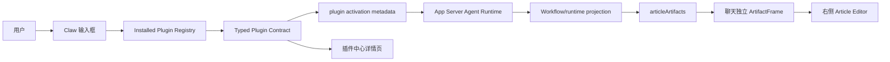
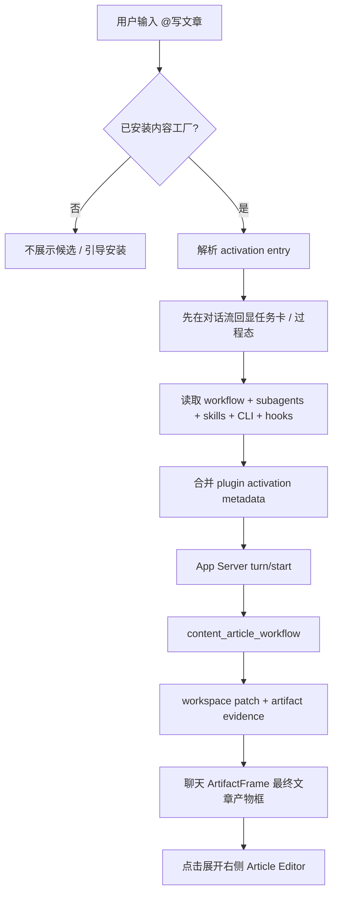

# Writing 架构设计

> 状态：`legacy current reference`。本文的 v1 架构记录已由 `./v2/product-requirements.md` 与 `./v2/content-factory-plugin-reframe.md` 替换；新增或修改的 current 边界必须回写 v2 文档。

更新时间：2026-06-30
状态：`legacy current reference`；current 架构以 `./v2/README.md`、`./v2/product-requirements.md` 与 `../../aiprompts/architecture.md` 为准

## 1. 一句话架构

```text
Content Factory Plugin
  -> plugin.json
  -> mcp.json + skills/<skill>/SKILL.md
  -> App Server plugin activation snapshot
  -> task card / process state
  -> content_article_workflow runtime projection
  -> Skills + MCP + tool/runtime capabilities
  -> App Server Agent Runtime
  -> articleDraft artifact / workspace patch
  -> Claw ArtifactFrame(articleArtifacts renderer) final artifact
  -> 右侧 Article Editor（dock / tab 标准见 ../rightsurface/README.md）
```

## 2. 系统上下文



## 3. 分层边界

| 层                 | 责任                                                                                                             | 不允许                                   |
| ------------------ | ---------------------------------------------------------------------------------------------------------------- | ---------------------------------------- |
| 内容工厂插件       | 提供标准 `plugin.json`、根 `mcp.json` 和 `skills/<skill>/SKILL.md`；通过这些能力参与写作。 | 直接控制 Lime 右侧栏布局或扩展私有 manifest。 |
| Lime 插件 contract | 读取并归一化标准包，生成 typed catalog/activation projection。                                                     | 为内容工厂 hard code 入口或默认能力。       |
| Claw 输入框        | 从 installed registry 生成 `@` 候选并发送 metadata，任务卡和过程态留在对话流里，再承接最终产物。                       | 未安装时伪造 `@写文章`。                 |
| App Server Runtime | 执行 turn、注入 plugin activation context、保存 read model。                                                     | 让前端 mock 代替 runtime 结果。         |
| Workflow projection  | 执行写作 workflow，产出 workspace patch 和 evidence。                                                            | 让前端 mock 代替真实 runtime 结果。       |
| 聊天消息区         | 展示运行状态、任务卡、过程态；独立 `ArtifactFrame` 只承载最终文章，文章 renderer 可在框内完整流式输出最终文章。                 | 把完整正文散落到普通 assistant message。 |
| Right Surface      | 承载 Article Editor、编辑动作、历史恢复；dock / tab 规则见 `../rightsurface/README.md`。                          | 直接调用 provider 或插件私有文件系统。   |
| Article Workspace  | 插件工作区事实、调度桥、历史恢复输入；右侧布局规则归 `../rightsurface/README.md` 统一。                            | 恢复旧 Profile 命名或兼容入口。          |

Writing 不再单独定义右侧 dock / tab / pane 机制，相关布局与 surface 升降级都以 `../rightsurface/README.md` 为准。

## 4. 插件包事实源

插件包标准见 [Plugin v3 总览](../plugin/v3/README.md) 与 [目标合同](../plugin/v3/01-target-contract.md)。
内容工厂插件只提交标准目录：

```text
plugin-root/
├── plugin.json
├── mcp.json
└── skills/<skill>/SKILL.md
```

`plugin.json` 只声明标准身份和显式 Codex extension namespace；不得声明 workflow、独立执行器、
工作区、renderer 或任意可执行路径。`mcp.json` 与 Skills 是可选能力入口，错误按组件
隔离并 fail closed。

`content_article_workflow`、activation entries、subagents、CLI/connectors/hooks、
`articleDraft` 和 `articleArtifacts` 是 Lime App Server/runtime 的产品投影：App Server 从
安装态与当前 turn 生成 activation metadata、workflow evidence 和 workspace patch，Thread/
Turn/Item read model 再供 Claw 与 Right Surface 消费。它们不是插件 manifest 的第二套事实源。

宿主只消费 typed projection，不读取包内旧声明、独立执行器或 renderer registry，也不在 renderer
层维护 installed/activation 状态。

## 5. 数据模型

### 5.1 plugin activation metadata

```ts
type WritingPluginActivationMetadata = {
  plugin_activation: {
    source: "plugin_explicit_mention";
    trigger: "@写文章" | "@写作" | "@内容工厂";
    plugin_id: "content-factory-app";
    active_entry_key: "content_article_generate";
    workflow_key: "content_article_workflow";
    workflow?: {
      key: string;
      steps: Array<{ id: string; subagent?: string; skillRefs?: string[] }>;
    };
    subagents?: Array<{ id: string; title: string; skills?: string[] }>;
    skill_refs?: Array<{ id: string; title: string }>;
    cli_refs?: Array<{ id: string; title?: string }>;
    connector_refs?: Array<{ id: string; title?: string }>;
    hook_policy?: { prompt?: string[]; tool?: string[]; task?: string[] };
    default_prompts?: string[];
  };
};
```

### 5.2 workspace patch

```ts
type ArticleWorkspacePatch = {
  pluginId: "content-factory-app";
  primaryObjectRef: {
    pluginId: "content-factory-app";
    objectKind: "articleDraft";
    objectId: string;
    artifactIds: string[];
  };
  objects: Array<{
    objectKind: "articleDraft";
    title: string;
    status: "running" | "ready" | "needs_review" | "failed";
  }>;
};

type ArticleArtifact = {
  artifactKind: "articleDraft";
  rendererKind: "article-editor";
  title: string;
  summary: string;
  status: "running" | "ready" | "needs_review" | "failed";
  document: {
    format: "markdown" | "artifact_document.v1";
    body: string;
  };
  researchRounds: Array<{ title: string; sourceCount: number }>;
  citations: Array<{ title: string; url?: string }>;
  imageSlots: Array<{ id: string; title: string; prompt: string }>;
};

type ArtifactFrameContract = {
  frameKind:
    | "document"
    | "image_set"
    | "table"
    | "presentation"
    | "webpage"
    | "report"
    | "code"
    | "media";
  rendererKind: string;
  title: string;
  status: "streaming" | "ready" | "needs_review" | "failed";
  bodyMode: "streaming_full" | "summary" | "gallery" | "preview";
  openTarget?:
    | "article-editor"
    | "artifact-viewer"
    | "media-viewer"
    | "browser-preview";
};
```

## 6. 运行流程图



## 7. 部署边界

| 仓库                                                         | 责任                                                                                                                                                           |
| ------------------------------------------------------------ | -------------------------------------------------------------------------------------------------------------------------------------------------------------- |
| `/Users/coso/Documents/dev/ai/limecloud/content-factory-app` | 内容工厂标准包、`plugin.json`、`mcp.json`、Skills 与外部产品验证；workflow 设计不扩展 portable manifest。 |
| `/Users/coso/Documents/dev/ai/aiclientproxy/lime`            | 插件安装态读取、manifest normalize、typed plugin contract、输入栏建议、activation metadata、ArtifactFrame、articleArtifacts、Article Editor、GUI / Playwright 验证。 |

## 8. 架构风险

| 风险                        | 约束                                                                                              |
| --------------------------- | ------------------------------------------------------------------------------------------------- |
| 宿主继续 hard code 内容工厂 | 所有 `@写文章`、workflow、subagent 断言绑定 typed activation projection / installed registry。   |
| runtime 只返回长正文        | schema 和测试要求返回 workspace patch、artifact、evidence。                                        |
| 插件中心只显示营销卡片      | 详情页必须投影 subagents、CLI tools、connectors、hooks、authorization、skills。                   |
| 未登录阻断本地插件          | marketplace auth error 和 installed registry 分离。                                               |
| 右侧栏被插件重建            | 右侧 dock 由 Host 管理，插件只声明 article renderer / surface contract。                          |
| 旧 Profile 路径回流         | 旧 Profile 路径归类为 dead；文章用户界面和内部工作区都必须走 Article Workspace / Article Editor。 |
