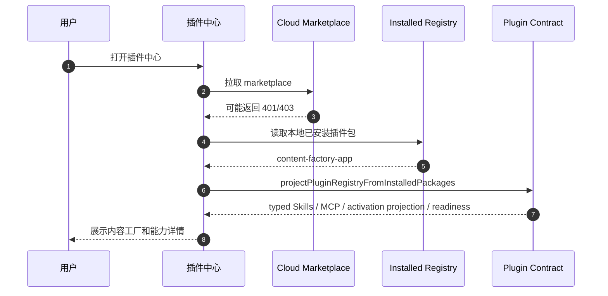
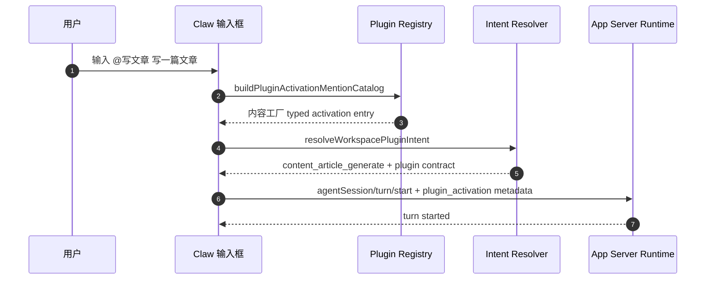
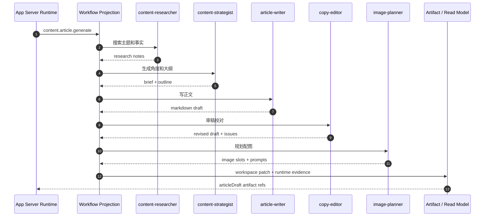
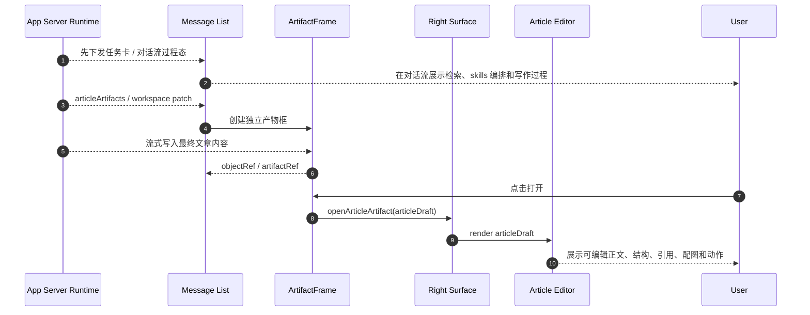
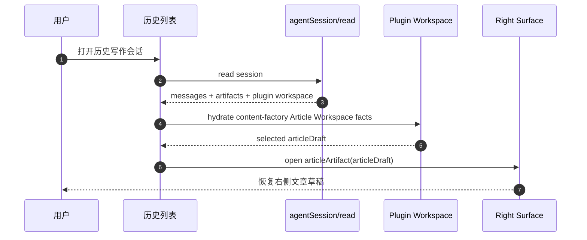
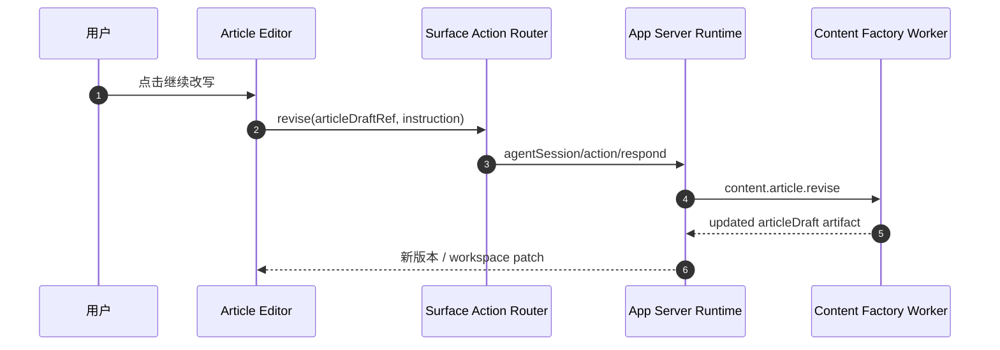

# Writing 时序图

> 状态：`legacy current reference`。本文的 v1 时序记录已由 `./v2/product-requirements.md` 中的 current 流程与时序替换；新增时序只写入 v2 文档。

更新时间：2026-06-30
状态：`legacy current reference`；current 时序以 `./v2/product-requirements.md` 和 `./v2/content-factory-plugin-reframe.md` 为准

## 1. 插件中心安装态展示

## 2. `@写文章` 激活

## 3. 写作 workflow 执行

## 4. ArtifactFrame 到右侧 Article Editor

## 5. 历史恢复

## 6. 继续改写

