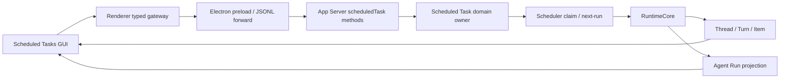
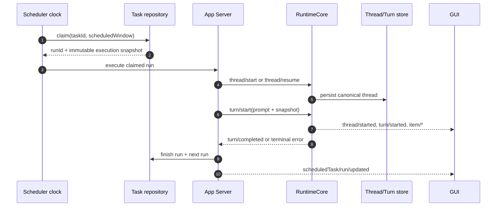

# 已安排任务运行架构

状态：`normative architecture target`

## 1. 唯一产品链

Electron 不承接 scheduler 或业务 repository；Renderer 不维护生产 timer；scheduler 不直接调用 provider。

## 2. Owner 责任

| Owner                             | 责任                                               | 禁止                        |
| --------------------------------- | -------------------------------------------------- | --------------------------- |
| App Server protocol               | typed method/schema/notification                   | 携带 secret、复制 Turn 事件 |
| App Server scheduled task domain  | CRUD、校验、迁移、read model                       | 调用 Electron API           |
| `scheduler`                       | next-run、claim、catch-up、overlap、持久化调度状态 | 直接构造 provider request   |
| RuntimeCore/agent-runtime         | 创建/恢复 Thread、启动 Turn、工具/审批生命周期     | 读取 renderer store         |
| thread-store/Agent Run repository | 历史、恢复与来源关系                               | 维护第二套 task 配置        |
| Renderer gateway/VM               | 请求、normalize、过滤/formatter                    | 裸 invoke、业务事实落盘     |
| Desktop Host                      | JSONL 转发、OS 通知、应用生命周期信号              | 第二业务后端                |

## 3. 到期运行时序

`finish run` 只能由 canonical terminal Turn 或明确的启动失败产生；不得靠固定 timer 合成成功。

## 4. 对话策略

### `new_thread`（默认）

- 每次运行创建独立 Thread。
- Thread metadata 记录 taskId、runId、sourceThreadId、trigger、scheduledFor。
- 优点：运行隔离、历史清晰、上下文不会无限膨胀。

### `continue_thread`

- 每次运行恢复同一 canonical Thread 并启动新 Turn。
- 适合需要长期状态连续的监控任务。
- Thread 被归档仍可由 scheduler 恢复；Thread 被永久删除时 Task 进入 `needs_attention`，不得静默新建。

## 5. 生命周期与补跑

- App Server 启动时读取所有 enabled task，重算 next run 并识别 missed window。
- macOS/Windows 休眠唤醒后执行同一 reconcile。
- P0 catch-up：最近窗口 <= 24h 且没有相同幂等键时最多补一次。
- 多个漏跑窗口折叠为一次 `catch_up`，metadata 记录 skipped window count。
- 时钟回拨不能重复执行已 claim 窗口；时钟前跳按 missed policy 处理。

## 6. 失败、审批与取消

- Provider/tool error 由 runtime 投影真实 terminal status。
- 等待审批不会阻塞 scheduler 主循环；Run 状态为 `waiting_for_approval`。
- 超时通过 runtime cancellation token 取消 Turn，并记录 `timed_out`；不留下永久 running。
- 应用退出时正在运行的任务，重启后按 Thread/Turn read model 恢复；无法证明仍运行则标记 interrupted/failed，不能假成功。
- 删除任务不自动取消当前 Run；确认弹窗必须说明并提供“同时取消运行”选项（仅 runtime 支持时）。

## 7. 安全与隐私

- Task 只存 provider/model reference，不存凭证。
- cwd 必须经统一路径 owner 规范化并同时考虑 macOS/Windows。
- full access 必须显式确认；从对话创建时展示权限摘要。
- 任务 prompt 和运行结果属于用户数据，走统一数据库/平台路径。
- 日志默认不记录完整 prompt、工具输出、环境变量或通知正文。
- OS 通知锁屏内容默认只显示任务名与状态，详情由用户设置决定。

## 8. 可观测性

最低指标：

- claim delay / start delay / run duration。
- due/claimed/started/completed/failed/timed_out/missed 数量。
- duplicate claim prevented。
- catch-up count / overlap skipped。
- task config invalidation reason。

每个指标必须可关联 taskId/runId/threadId/turnId，但用户导出时按隐私规则脱敏。

## 9. 架构确认

本路线涉及 App Server method、scheduler data model、Thread/Turn metadata 与 OS notification，属于跨域重大架构变更。实现同一变更集必须更新 `internal/aiprompts/architecture.md`，并在执行计划和 PR 描述记录架构图确认；本需求文档本身不代表实现已获确认。
