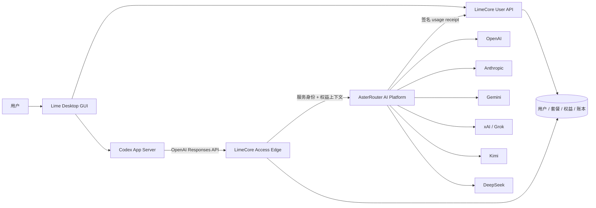
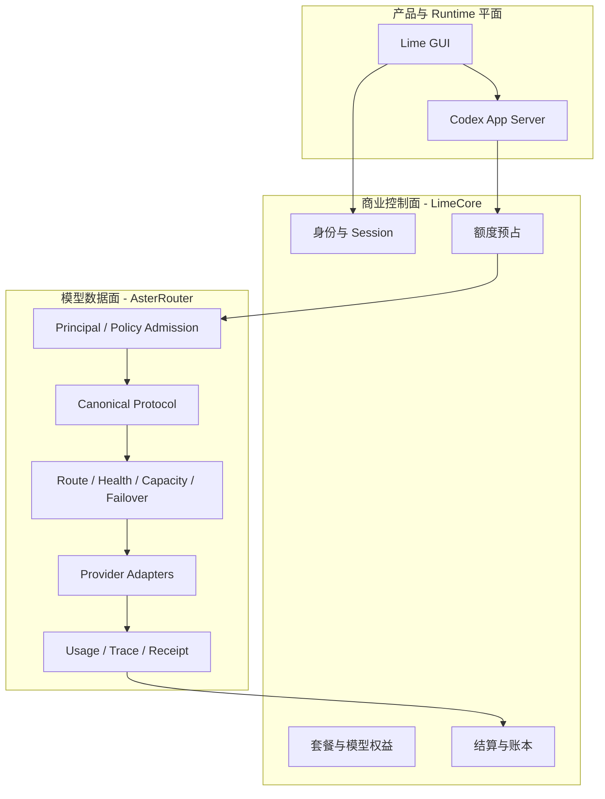
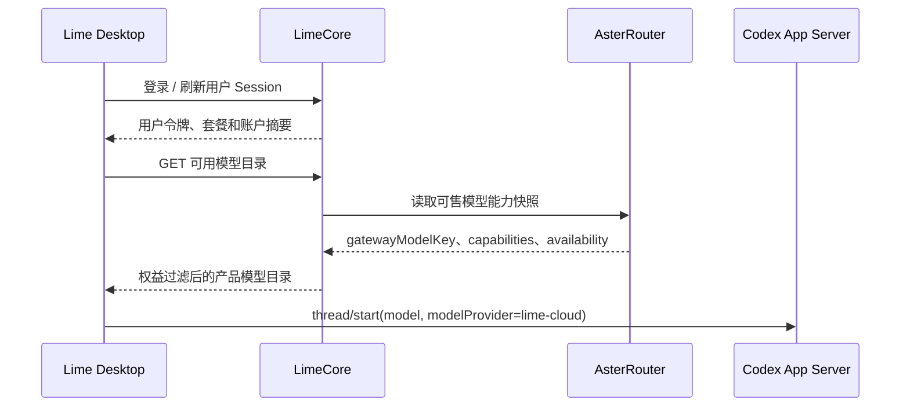
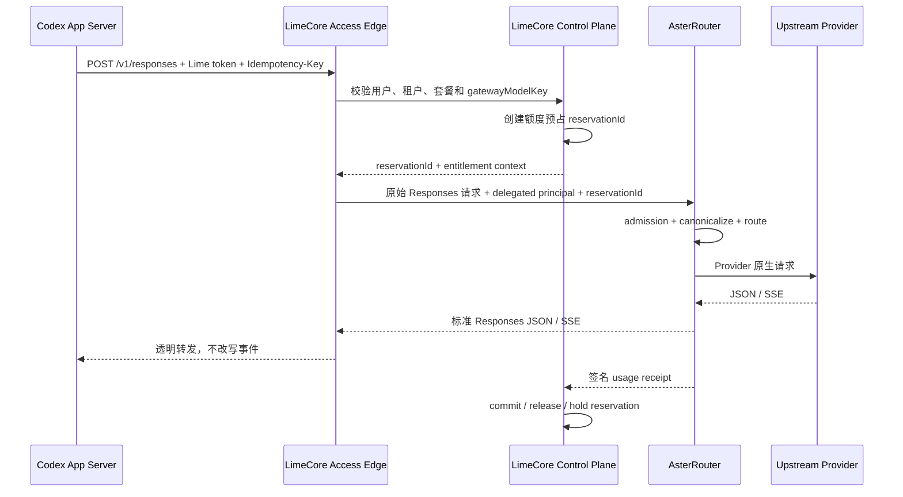
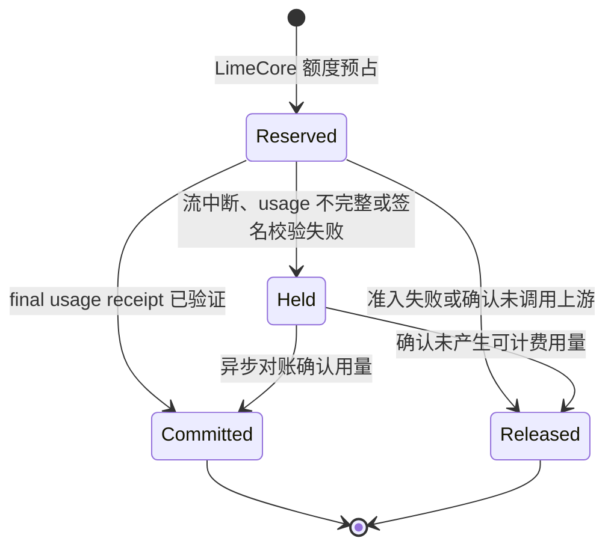

# Lime 云端多模型平台架构

状态：target

决策日期：2026-07-29

适用范围：Lime Desktop、Codex App Server、LimeCore、AsterRouter 组成的云托管模型调用链。

## 1. 决策结论

Lime 的云端多模型能力按商业控制面、模型数据面和桌面运行时分离：

- Lime Desktop 负责桌面 GUI、Codex App Server 生命周期和 Thread / Turn / Item 展示，不实现第二套 Agent Runtime。
- Codex App Server 继续负责 Agent loop、上下文、工具、MCP、Skills、Multi-Agent 和会话状态机。
- LimeCore 是用户与商业事实源，负责用户、租户、登录、订阅、套餐、模型权益、额度预占、结算和账本。
- AsterRouter 是云端模型网关唯一 owner，负责协议归一、Provider 路由、健康与容量、故障切换、流式事件、错误和 usage 标准化。
- 上游 Provider Secret 只进入 AsterRouter 或其 Secret Store；Lime Desktop 和 LimeCore 不持有云端供应商密钥。

首期链路固定为：

```text
Lime Desktop / Codex App Server
  -> LimeCore Access Edge: 用户鉴权、权益检查、额度预占
  -> AsterRouter AI Platform Data Plane: Responses 网关与 Provider 路由
  -> OpenAI / Anthropic / Gemini / xAI / Kimi / DeepSeek / 其他上游
  -> AsterRouter: 标准 Responses SSE + 签名 usage receipt
  -> LimeCore: 提交、释放或挂起额度预占
  -> Codex App Server
```

LimeCore 可以保留 `llm.limeai.run` 公网入口和透明流式代理，但不得继续拥有 Provider adapter、协议转换、模型路由或上游重试。是否经过 LimeCore 不改变 AsterRouter 作为模型数据面唯一 owner 的结论。

## 2. 目标与非目标

### 2.1 目标

1. 在不重写 Codex Agent Runtime 的前提下支持 Claude、Gemini、Grok、Kimi、DeepSeek 等模型。
2. 让 Codex 始终消费 OpenAI Responses API，供应商差异全部在 AsterRouter 内收敛。
3. 保留 LimeCore 现有用户、套餐、Token 积分、额度预占和账本闭环。
4. 保证模型请求、流式响应、错误和 usage 在跨服务后仍可追踪、幂等和对账。
5. 为 macOS 与 Windows 使用同一服务端协议和凭证边界。

### 2.2 非目标

- 不在 Lime Desktop、Electron 或 Renderer 内实现 Claude/Gemini 等云端 Provider adapter。
- 不复制 Codex 的 Agent loop、工具状态机、会话恢复或 MCP Runtime。
- 不让 AsterRouter 创建 Lime 最终用户、登录 Session、订阅、订单、余额或积分账本。
- 不让 LimeCore 继续演进第二套模型协议转换和 Provider 路由。
- 首期不让 Codex 使用 LimeCore 签发的短期令牌直连 AsterRouter。

## 3. 系统上下文



系统只有一条 Agent 产品主链：

```text
Electron Desktop Host
  -> App Server JSON-RPC
  -> Codex Runtime
  -> OpenAI Responses-compatible provider
  -> LimeCore Access Edge
  -> AsterRouter
  -> upstream provider
  -> Thread / Turn / Item projection
  -> GUI
```

Electron 只承接进程、窗口、安全存储和 IPC，不成为业务后端。Renderer 只消费 App Server 投影和 LimeCore 用户 API，不直接调用 AsterRouter。

## 4. 职责与唯一 Owner

| 领域 | 唯一 Owner | 职责 | 明确禁止 |
| --- | --- | --- | --- |
| 桌面产品 | Lime Desktop | GUI、登录入口、模型选择、App Server 生命周期、投影展示 | Provider 协议转换、云端计费、第二 Agent Runtime |
| Agent Runtime | Codex App Server / Codex Runtime | Agent loop、Thread / Turn / Item、工具、MCP、Skills、Multi-Agent、历史恢复 | 用户套餐和 Provider 账号池 |
| 用户与商业控制面 | LimeCore | 用户、租户、Session、订阅、订单、套餐、权益、预占、结算、账本 | Provider Secret、协议适配、模型健康与故障切换 |
| 公网商业入口 | LimeCore Access Edge | 用户鉴权、模型权益检查、额度预占、请求关联、透明 SSE 代理 | Provider 选择、响应重编码、上游重试、流式语义修复 |
| 模型数据面 | AsterRouter | Canonical request、Provider adapter、模型路由、健康、容量、熔断、重试、SSE、错误、usage receipt | Lime 最终用户、订阅、订单、余额 |
| Provider 凭证 | AsterRouter Secret Store | 上游 API Key、OAuth/服务凭证、轮换和审计 | 下发给 LimeCore 或桌面端 |
| 本地 Provider 传输 | Lime `model-provider` | Codex Runtime 的客户端请求构造、Responses 传输和事件归一 | 在云托管链路重复实现 Claude/Gemini 等服务端 adapter |

### 4.1 两个 Provider 边界并不冲突

Lime `model-provider` 与 AsterRouter 位于不同进程和信任边界：

- Lime `model-provider` 是桌面 Runtime 的出站客户端边界。云托管模型统一走一个 Responses-compatible provider，例如 `lime-cloud`。
- AsterRouter 是服务端网关边界。它把 Responses 转换为真实上游协议，并把结果重新编码为 Responses。

因此，Claude、Gemini、Grok、Kimi、DeepSeek 对 Codex 来说都是 `lime-cloud` 下的不同模型，而不是五套桌面 Agent Runtime 或五套桌面协议实现。

## 5. 平面划分



## 6. 核心调用流程

### 6.1 登录与模型目录



模型目录不是一份数据的双写：

- LimeCore 持有产品模型名、展示、套餐可见性、价格和用户权益。
- AsterRouter 持有 gateway model、上游 model、Provider account、能力、健康、容量和路由。
- 两者通过稳定的 `gatewayModelKey` 关联；LimeCore 不引用 Provider account 或上游密钥。
- Renderer 不维护独立云端目录，离线展示只能使用明确标记的缓存快照。

Codex 的 Provider 选择按 Thread 固定。`thread/start` 同时传 `model` 和 `modelProvider`；同一个 `lime-cloud` Provider 下可以在后续 Turn 切换模型。需要改变 Provider 信任边界时，应创建或重新配置 Thread，不能由 Renderer 暗中替换。

### 6.2 模型请求与流式响应



请求链必须满足：

1. LimeCore 在调用 AsterRouter 前完成用户鉴权、模型权益检查和额度预占。
2. LimeCore 只读取准入所需的稳定元数据，例如公开模型键；请求正文和 SSE 事件语义归 AsterRouter。
3. AsterRouter 只能在客户端尚未收到用户可见事件前执行安全重试或故障切换。
4. 首个用户可见事件发出后不得跨 Provider 重放，避免重复正文和工具副作用。
5. AsterRouter 对外恢复为标准 Responses 事件；Codex 不感知真实上游协议。
6. LimeCore 必须逐字节透明转发 SSE，不能缓冲完整响应后再发送，也不能重新编码事件。

### 6.3 结算与补偿



AsterRouter 返回的 usage receipt 至少需要包含：

| 字段 | 说明 |
| --- | --- |
| `receiptId` | receipt 的全局稳定标识 |
| `requestId` | AsterRouter 请求标识 |
| `idempotencyKey` | 端到端幂等键 |
| `reservationId` | LimeCore 额度预占标识 |
| `tenantId` / `principalId` | AsterRouter AI Platform 调用方，不是 Lime 用户对象副本 |
| `gatewayModelKey` | LimeCore 与 AsterRouter 的稳定模型关联键 |
| `upstreamModel` | 实际执行模型，仅用于审计和成本核算 |
| `providerId` | 实际 Provider 路由标识，不下发给普通客户端 |
| `inputTokens` / `outputTokens` | 标准化 Token 用量 |
| `status` | `completed`、`upstream_error`、`cancelled` 或 `uncertain` |
| `startedAt` / `completedAt` | 请求时间边界 |
| `signature` / `keyId` | AsterRouter 对 receipt 的签名和轮换键标识 |

同一 `reservationId + idempotencyKey` 的重复 receipt 必须幂等。LimeCore 只根据已验证 receipt 提交最终账本；无法确认的用量进入 `Held` 和异步对账，不能静默按零用量退款。

## 7. 鉴权与凭证边界

### 7.1 首期

```text
Lime Desktop
  -- Lime user/API token -->
LimeCore Access Edge
  -- service identity + delegated claims -->
AsterRouter AI Platform
  -- provider credential -->
Upstream
```

- Lime 用户令牌只由 LimeCore 签发和验证。
- Lime Desktop 只通过 macOS Keychain、Windows Credential Manager/DPAPI 对应的统一安全存储保存用户令牌。
- LimeCore 到 AsterRouter 使用独立服务身份，采用短期 JWT/JWKS、HMAC 或 mTLS；不得透传 Lime 用户密码或 Provider Secret。
- delegated claims 只携带调用所需的 tenant、principal、model allowlist、reservation 和 request identity。
- AsterRouter 按 AI Platform 模式建模非人类 Principal，不复制 Lime 用户、Session、订阅或余额。

### 7.2 后续可选直连

未来可以让 LimeCore 签发短期 delegated JWT，由 Codex 直连 AsterRouter：

```text
Codex App Server -> AsterRouter -> upstream
                          |
                          +-> usage receipt -> LimeCore
```

该路径只有在令牌刷新、撤销、额度强一致、失败补偿和 Codex Provider 凭证刷新全部完成后才能启用。首期不得为了少一层代理牺牲计费闭环。

## 8. 协议边界

Codex 当前自定义 Provider 的云端契约固定为 OpenAI Responses API：

```toml
[model_providers.lime-cloud]
name = "Lime Cloud"
base_url = "https://llm.limeai.run/v1"
env_key = "LIME_CLOUD_API_KEY"
wire_api = "responses"
```

该片段表达目标契约，不表示可以把长期用户密钥明文写入配置文件。实际凭证由 Desktop Host 安全注入。

AsterRouter 内部执行以下转换：

```text
OpenAI Responses request
  -> canonical request/content/tools
  -> route selected upstream protocol
       -> OpenAI Responses / Chat
       -> Anthropic Messages
       -> Gemini GenerateContent
       -> compatible Grok / Kimi / DeepSeek protocol
  -> canonical stream/error/usage
  -> OpenAI Responses response events
```

工具调用、reasoning、图片、音频和其他 message part 只有在 AsterRouter capability 声明支持且转换无损时才允许进入对应模型。无法保持 Codex 语义的模型必须在请求上游前 fail closed，不能静默丢字段。

## 9. 失败与重试语义

| 场景 | Owner | 处理 |
| --- | --- | --- |
| 用户令牌无效 | LimeCore | 在预占前拒绝 |
| 套餐或模型无权限 | LimeCore | 在预占前拒绝，返回稳定产品错误 |
| 额度不足 | LimeCore | 不调用 AsterRouter |
| AsterRouter admission 拒绝 | AsterRouter | 返回标准 Responses 错误；LimeCore 释放预占 |
| Provider 不健康或限流 | AsterRouter | 首个可见事件前按路由策略重试/切换 |
| SSE 已输出后断流 | AsterRouter + LimeCore | 不重放；receipt 标记 partial/uncertain，预占进入 Held |
| receipt 签名无效 | LimeCore | 不结算、不退款，进入 Held 并告警 |
| LimeCore 回写暂时失败 | LimeCore worker | 按 receiptId 幂等重试 |
| 客户端主动取消 | Codex + AsterRouter | 传播取消；按已确认 usage 结算 |

错误对外统一为 Responses-compatible envelope，同时保留稳定的产品错误码和 `requestId`。Provider 原始错误、账号、密钥、内部路由和供应成本不能直接暴露给桌面端。

## 10. 可观测性与数据保护

端到端统一携带：

- `traceId`
- `requestId`
- `idempotencyKey`
- `reservationId`
- `tenantId`
- `principalId`
- `gatewayModelKey`

默认日志只记录请求元数据、路由结果、状态、延迟和 usage，不记录完整 prompt、response、工具参数、图片正文或凭证。需要内容级诊断时必须经过显式授权、脱敏、限时保留和审计。

LimeCore 与 AsterRouter 分别保留自己的事实：

- LimeCore：谁获得了什么产品权益、预占和最终扣费多少。
- AsterRouter：哪个 gateway model 经何种路由执行、技术用量和成本是多少。
- Codex ThreadStore：用户可见的 Thread / Turn / Item 历史。

三者通过稳定 identity 关联，不互相复制完整业务对象或对话正文。

## 11. 迁移与收敛计划

### Phase 0：冻结 owner

- 新增云端 Provider 时，只在 AsterRouter 增加 adapter、route 和协议测试。
- LimeCore 不再新增 Provider-specific lowering、SSE reducer 或路由策略。
- Lime Desktop 不再增加云托管 Provider Secret 或第二 Agent Runtime。

### Phase 1：打通 Responses 主链

```text
Codex -> LimeCore Access Edge -> AsterRouter /v1/responses -> one upstream
```

- 建立 AsterRouter AI Platform tenant、principal 和服务鉴权。
- 定义 delegated claims、幂等键、reservation 和签名 usage receipt 合同。
- LimeCore Access Edge 透明代理 JSON/SSE；AsterRouter 负责完整 Responses 语义。

### Phase 2：模型目录与权益

- AsterRouter 输出 gateway model capability/availability 快照。
- LimeCore 将 gateway model 映射为产品模型、价格和套餐权益。
- Desktop 从 LimeCore 获取过滤后的目录，并通过 App Server `model/list` / Thread 配置展示和选择。

### Phase 3：多 Provider 路由

- 按能力逐个接入 Claude、Gemini、Grok、Kimi 和 DeepSeek。
- 每个模型分别验证 tools、reasoning、stream、usage、错误和取消，不按品牌名称假设能力。
- 只有通过 Responses contract 的模型才能进入 Codex 产品目录。

### Phase 4：删除双轨

- LimeCore `gateway-svc` 收缩为 Access Edge；删除或迁出 Provider adapter、协议转换和模型路由实现。
- 删除 LimeCore 与 AsterRouter 重复的模型健康、路由、SSE 重编码和上游凭证配置。
- 为被删除入口增加负向回流守卫，禁止以后恢复第二网关。

### Phase 5：评估直连

仅在代理层成为可测量瓶颈，且短期令牌与结算补偿合同已经稳定后，再评估 Codex 直连 AsterRouter。没有数据证明前不实施。

## 12. 验收门禁

首期只有同时满足以下证据才算打通：

1. 真实 Electron 启动 Codex App Server，而不是浏览器 mock。
2. `thread/start` 使用 `modelProvider=lime-cloud` 和权益允许的模型。
3. 请求真实经过 LimeCore Access Edge 和 AsterRouter `/v1/responses`。
4. AsterRouter 至少完成一次非 OpenAI 上游协议转换，并向 Codex 返回合法 Responses SSE。
5. 工具调用、正文 delta、完成、取消和错误都形成正确的 Thread / Turn / Item 投影。
6. 成功请求提交额度预占，准入失败释放预占，断流进入 Held 后可对账。
7. 重复 `idempotencyKey` 不产生重复上游调用或重复扣费。
8. macOS 与 Windows 使用相同协议，且用户令牌不以明文写入配置或日志。

## 13. Current / Target / Deprecated / Forbidden

| 分类 | Surface | 说明 |
| --- | --- | --- |
| current | Codex App Server Agent Runtime | 继续作为 Agent loop 唯一 owner |
| current | LimeCore 用户、套餐、预占、账本 | 保留并继续演进 |
| current | AsterRouter Responses / Anthropic / Gemini 等协议入口和路由基础 | 作为目标数据面基础继续演进 |
| target | LimeCore Access Edge -> AsterRouter | 首期云托管模型主链 |
| target | AsterRouter 签名 usage receipt -> LimeCore 结算 | 跨服务计费闭环 |
| deprecated | LimeCore 内部 Provider adapter、协议转换和模型路由 owner | 迁移后删除，不保留双轨 |
| forbidden | Lime Desktop 云端供应商密钥和 Provider-specific adapter | 不得新增 |
| forbidden | AsterRouter Lime 用户、Session、订阅、订单或余额模型 | 不得新增 |
| forbidden | LimeCore 与 AsterRouter 同时决定 Provider 路由 | 必须只有 AsterRouter 决策 |

当前 LimeCore 文档和代码仍把 `gateway-svc` 定义为 LLM 数据面 owner。在 Phase 1 至 Phase 4 完成前，该实现仍是运行事实；本文件描述已确认的目标架构，不能被用来宣称迁移已经完成。

## 14. 事实依据

- Codex 自定义 Provider 与 Responses 限制：`/Users/coso/Documents/dev/rust/codex/codex-rs/model-provider-info/src/lib.rs`
- Codex Thread Provider 参数：`/Users/coso/Documents/dev/rust/codex/codex-rs/app-server-protocol/src/protocol/v2/thread.rs`
- LimeCore 当前 LLM 架构：`/Users/coso/Documents/dev/ai/limecloud/limecore/docs/llm/architecture.md`
- LimeCore 云端中转入口：`/Users/coso/Documents/dev/ai/limecloud/limecore/docs/llm/README.md`
- AsterRouter 产品边界与 AI Platform 模式：`/Users/coso/Documents/dev/ai/astercloud/asterrouter/README.md`
- AsterRouter 协议入口：`/Users/coso/Documents/dev/ai/astercloud/asterrouter/backend/internal/server/gateway_protocols.go`
- AsterRouter canonical protocol：`/Users/coso/Documents/dev/ai/astercloud/asterrouter/backend/internal/gatewaycore/model.go`
- AsterRouter Responses/stream 转换测试：`/Users/coso/Documents/dev/ai/astercloud/asterrouter/backend/internal/server/gateway_protocols_test.go`
